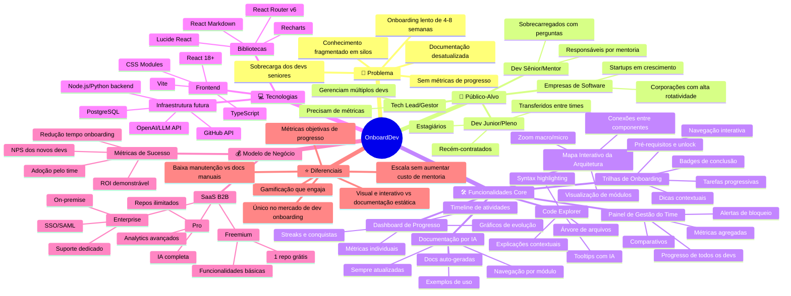

# Etapa 5 — Mapa Mental

## Objetivo

Representar visualmente todas as dimensões do OnboardDev — funcionalidades, público-alvo, tecnologias, modelo de negócio e diferenciais — em um mapa mental estruturado que facilite a compreensão holística da solução.

---

## 5.1. Mapa Mental — OnboardDev

---

## 5.2. Descrição dos Ramos Principais

### 🎯 Problema
O ramo central que justifica a existência do OnboardDev. Cada sub-ramo representa uma dimensão do problema de onboarding identificada na fase de pesquisa.

### 👥 Público-Alvo
Três personas principais com dores distintas: o dev que precisa aprender, o sênior que precisa ensinar, e o gestor que precisa acompanhar. Cada persona se beneficia de funcionalidades diferentes da plataforma.

### 🛠️ Funcionalidades Core
O coração do produto, dividido em 6 módulos principais que atacam diferentes aspectos do problema. Cada módulo pode funcionar independentemente, mas o valor máximo é entregue quando usados em conjunto.

### 💻 Tecnologias
Stack tecnológico escolhido para o protótipo (frontend-only) e visão futura de infraestrutura completa. A escolha de React + TypeScript garante escalabilidade e manutenibilidade.

### 💰 Modelo de Negócio
Estratégia de monetização baseada em SaaS B2B com 3 tiers. O modelo freemium reduz a barreira de adoção, e o tier Enterprise atende preocupações de segurança de grandes empresas.

### ⭐ Diferenciais
Os 6 diferenciais competitivos que posicionam o OnboardDev como solução única no mercado, derivados diretamente da análise SWOT.

---

## 5.3. Conexões Entre Ramos

O mapa mental revela conexões importantes entre os ramos:

- **Problema → Funcionalidades:** Cada funcionalidade core ataca diretamente pelo menos uma dimensão do problema
- **Público-Alvo → Funcionalidades:** Cada persona tem funcionalidades específicas (dev → trilhas, sênior → docs IA, gestor → dashboard)
- **Tecnologias → Funcionalidades:** A escolha de React + visualizações interativas viabiliza o mapa interativo e code explorer
- **Diferenciais → Modelo de Negócio:** Os diferenciais justificam o pricing premium do tier Pro e Enterprise
- **Problema → Modelo de Negócio:** A universalidade e recorrência do problema sustentam o modelo SaaS com receita recorrente
